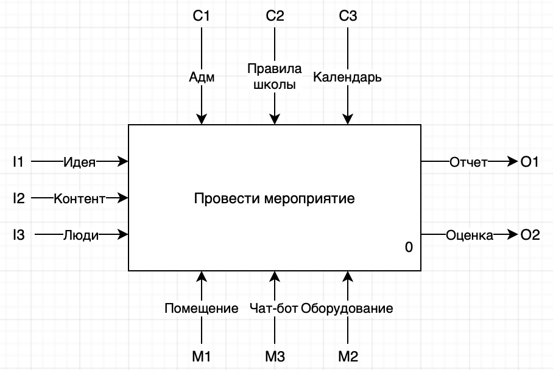
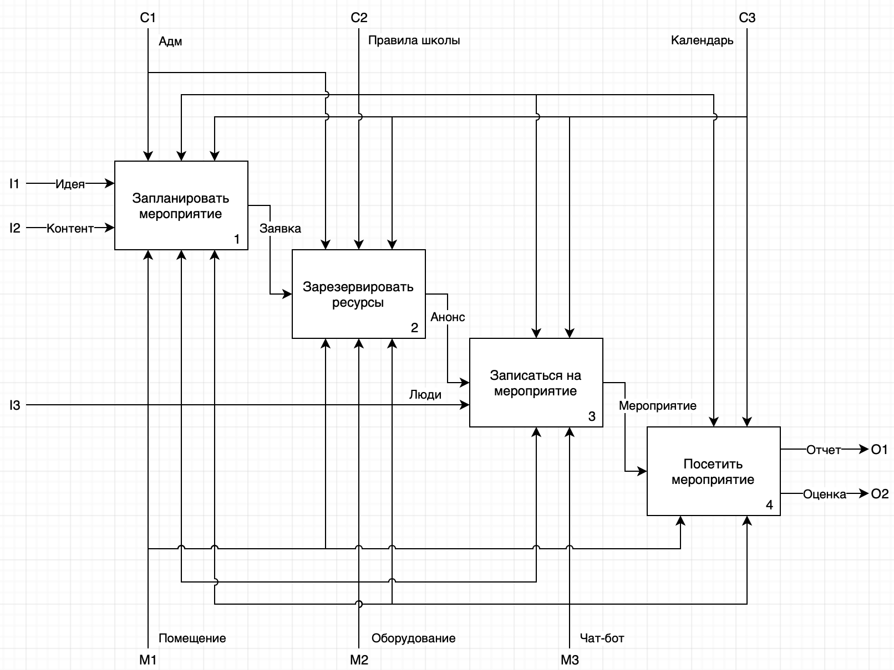

IDEF0
==

Диаграмма 0-го уровня - A0
--

Диаграмма 1-го уровня - A1
--

Входящие потоки
---
**I1 Идея** - основная идея мероприятия (например, показ анимации)

**I2 Контент** - контент для мероприятия (например презентации, выступления спикеров)

**I3 Люди** - участники мероприятия, зрители

Исходящие потоки
---
**O1 Отчет** - результаты мероприятия в виде отзывов, резюме мероприятия, фотоотчет

**O2 Оценка** - оценка качества мероприятия участниками (общая оценка, форма обратной связи и т.д.)

Управляющие потоки
---
**C1 Адм** - сотрудники школы 21, которые принимают решение по мероприятиям и бронированию

**C2 Правила школы** - формально описанные [правила школы](https://21-school.ru/rules)

**C3 Календарь** - календарь бронирования с просмотром дат и времени мероприятий

Механизмы
---
**M1 Помещение** - помещения школы, в которых может проводиться мероприятие (например Атриум)

**M2 Оборудование** - оборудование необходимое для проведения мероприятия (например телевизор)

**M3 Чат-бот** - ПО помогающее организовать процесс проведения мероприятий
